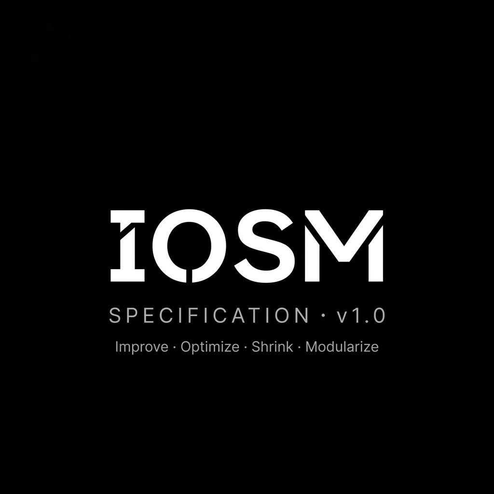
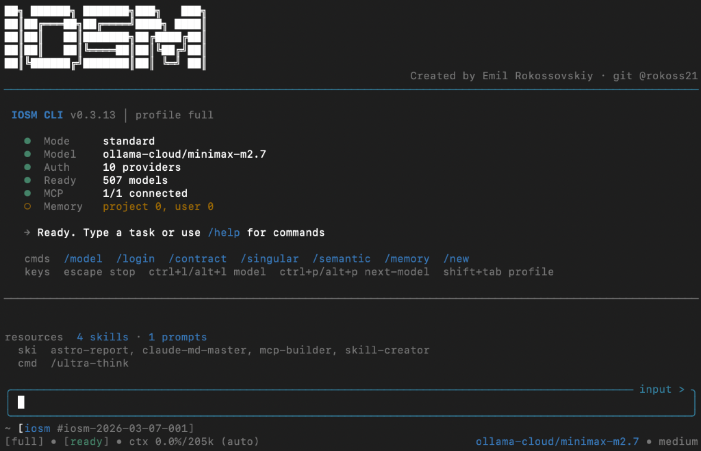
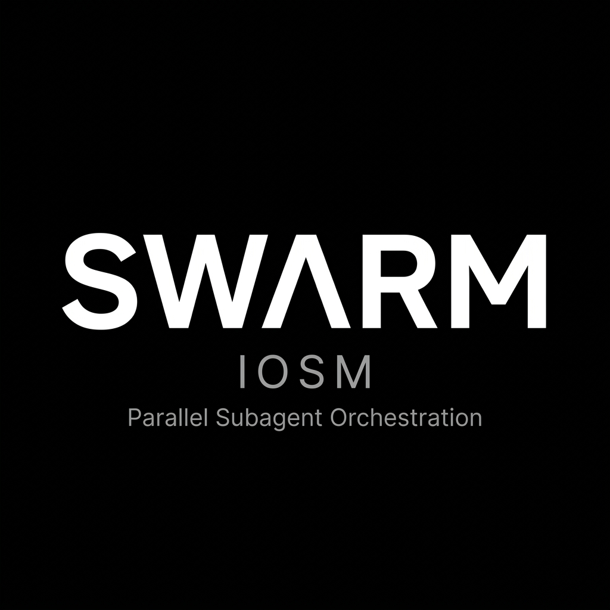

<div align="center">


<br>

```
"You can't build reliable systems on top of nondeterministic contracts."
```

<a href="https://rokoss21.tech">Website</a> · <a href="https://linkedin.com/in/rokoss">LinkedIn</a> · <a href="https://dev.to/rokoss21">DEV.to</a> · <a href="mailto:ecsiar@gmail.com">Email</a>

</div>

---

I build **the contract layer for AI execution**.

Most AI systems today have no contracts. A prompt goes in, something comes out, and the entire downstream pipeline hopes the shape is right. When it isn't — and it will be — the system retries, falls back, or silently degrades. There is no compile step. No type check. No guarantee. Just strings, probability, and prayer.

I think this is the central unsolved problem of production AI: **not intelligence, but reliability**. We have models that can reason, generate, and plan — but we have almost no infrastructure to ensure they do it the same way twice, in the same format, within the same resource bounds, with the same failure semantics.

This is the gap I work in.

**FACET** is a formal specification and compiler toolchain that treats AI behavior as compiled software. You define contracts — typed inputs, constrained outputs, explicit failure modes — and the compiler enforces them before the model ever runs. If the output doesn't match the contract, it's rejected. Not logged. Not retried. Rejected. The guarantee is structural, not statistical.

**IOSM** is the engineering methodology that sits alongside it: a reproducible improvement cycle with strict phases, quality gates, and canonical metrics. It answers a different question — not "does the system work?" but "is the system getting better, and can I prove it?"

Think of it as **what TypeScript did for JavaScript, but applied to AI execution**. TypeScript didn't make JavaScript smarter — it made JavaScript *accountable*. FACET does the same for LLMs.

Two ecosystems. One thesis: **AI systems should be engineered, not improvised.**

---

## Why This Matters in Practice

<table>
<tr>
<td width="50%" valign="top">

#### 💳 &nbsp; Payment Integration

**The problem:** LLM returns `{status: "ok"}` instead of `{status: "success"}`. Your payment service receives invalid data. Transaction state is unknown. Retry? Refund? Hope?

**With FACET:** `@output status: enum["success","failed"]` — enforced at compile time. If the output doesn't match the schema, the run is rejected before it reaches your service. Not retried. Rejected.

</td>
<td width="50%" valign="top">

#### 🔄 &nbsp; Codebase Refactoring

**The problem:** refactor "feels done". No baseline. No metrics. No evidence it actually got better. Ship and hope.

**With IOSM:** baseline snapshot → hypothesis → 4 gated phases → cycle report. Simplicity went from 0.51 → 0.65. Modularity 0.47 → 0.56. Not opinions — measurements.

</td>
</tr>
<tr>
<td width="50%" valign="top">

#### 🤖 &nbsp; Multi-Agent Systems

**The problem:** 8 agents run in parallel. 3 write to the same file. Outputs drift between runs. No rollback. No coordination. Chaos.

**With Swarm-IOSM:** file-level locks prevent conflicts. Quality gates reject substandard work. Auto-spawn fills capability gaps. Every agent operates within a contract — deterministic dispatch, not improvisation.

</td>
<td width="50%" valign="top">

#### ⚙️ &nbsp; AI-Assisted Development

**The problem:** you switch between 5 different AI tools. Each has its own context, its own memory, its own interface. Nothing connects. You are the integration layer.

**With IOSM-CLI:** one terminal, 507 models across 15+ providers, MCP tool integration, project memory, session checkpoints, built-in skills. A single runtime that understands your codebase — not a chat window with autocomplete.

</td>
</tr>
</table>

---

## The Standard

FACET is not another framework or wrapper. It is a **formal contract layer** — a specification that treats AI behavior as compiled software, not probabilistic improvisation.

The standard defines a **Neural Architecture Description Language (NADL)** with typed inputs, constrained outputs, deterministic variable evaluation (R-DAG), explicit token budget allocation (Token Box Model), and fail-closed runtime guards. Every contract compiles to **Canonical JSON** — a stable, diffable, cacheable intermediate representation that is identical regardless of which model, provider, or runtime executes it.

The broader ecosystem — compilers, agents, orchestrators — exists to **prove the standard in practice**, not to replace it. Designed to outlive any single vendor, model, or SDK.

> **Implementations may evolve. The contract remains.**

```facet
@system
  role: "payment-processor"

@input  amount:    float(min=0.01)
@input  currency:  enum["USD","EUR","GBP"]

@output status:    enum["success","failed"]
@output tx_id:     string(min_length=8)

@policy
  max_tokens: 512
  on_invalid_output: reject
```

↓ &nbsp; `facet-fct build payment.facet` &nbsp; ↓

```json
{
  "meta": { "version": "2.1.3", "hash": "a7f3c9..." },
  "inputs":  { "amount": { "type": "float", "min": 0.01 }, "currency": { "type": "enum", "values": ["USD","EUR","GBP"] } },
  "outputs": { "status": { "type": "enum", "values": ["success","failed"] }, "tx_id": { "type": "string", "min_length": 8 } },
  "policy":  { "max_tokens": 512, "on_invalid_output": "reject" }
}
```

<sub>Invalid output never reaches your service. The contract is enforced before generation, not after. Same inputs → same canonical JSON → same guarantees. Always.</sub>

<br>

<table>
<tr>
<td width="50%" valign="top">

#### FACET constrains execution

- **Typed contracts** — inputs and outputs are schema-enforced at compile time
- **Canonical JSON IR** — deterministic, stable-hashed, provider-independent
- **R-DAG evaluation** — variable dependencies resolved in guaranteed topological order
- **Token Box Model** — explicit budget allocation with compression/drop rules
- **Fail-closed guards** — invalid output is rejected, not logged and forwarded

</td>
<td width="50%" valign="top">

#### IOSM constrains evolution

- **4 strict phases** — Improve → Optimize → Shrink → Modularize
- **Quality gates** — each phase must pass before the next begins
- **6 canonical metrics** — complexity, simplicity, modularity, coverage, debt, performance
- **IOSM-Index** — single aggregate score that tracks system health over time
- **Reproducible cycles** — every improvement is baselined, hypothesized, measured, and reported

</td>
</tr>
</table>

---

## ⚡ The Core

<table>
<tr>

<td width="25%" align="center" valign="top">

<a href="https://github.com/rokoss21/facet-standard">
  
</a>

**[FACET Standard](https://github.com/rokoss21/facet-standard)**<br>
<sub><b>Normative Specification</b></sub>


<sub>v2.1.3 · REC-PROD<br>NADL · FTS · R-DAG · Token Box<br>Policy · Guards · Conformance</sub>

</td>

<td width="25%" align="center" valign="top">

<a href="https://github.com/rokoss21/facet-compiler">
  
</a>

**[facet-compiler](https://github.com/rokoss21/facet-compiler)**<br>
<sub><b>Reference Implementation</b></sub>


<sub>Rust · fct 0.1.2 · 6 crates<br>AST → FTS → R-DAG → Canonical JSON<br>Other impls must match its behavior</sub>

</td>

<td width="25%" align="center" valign="top">

<a href="https://github.com/rokoss21/IOSM">
  
</a>

**[IOSM Specification](https://github.com/rokoss21/IOSM)**<br>
<sub><b>Engineering Methodology</b></sub>


<sub>v1.0 · JSON schemas · Validator<br>4 phases · 6 metrics · Quality gates<br>Reproducible improvement cycles</sub>

</td>

<td width="25%" align="center" valign="top">

<a href="https://github.com/rokoss21/FACET_mcp">
  
</a>

**[FACET MCP](https://github.com/rokoss21/FACET_mcp)**<br>
<sub><b>Execution Boundary</b></sub>


<sub>SIMD 3.7× · WebSocket · 70 tests<br>execute · lenses · validate<br>Protocol adapter & host</sub>

</td>

</tr>
</table>

---

## ⚙️ IOSM CLI — The Runtime

> Most AI CLIs are optimized for conversation.<br>
> **IOSM CLI is optimized for controlled engineering execution** — working directly against your filesystem and shell, orchestrating agents, tracking metrics, and running improvement cycles that can be audited, repeated, and benchmarked.

<div align="center">

<a href="https://github.com/rokoss21/iosm-cli">
  
</a>

<br><br>

 &nbsp;  &nbsp;  &nbsp; 

</div>

<br>

<table>
<tr>
<td width="50%" valign="top">

#### What you get

| Area | Capability |
|:--|:--|
| **Daily coding** | Interactive TUI with file, search, edit, and shell tools |
| **Safety** | `/checkpoint`, `/rollback`, `/doctor`, granular permissions |
| **Complex changes** | `/contract` → `/singular` → `/swarm` — deterministic execution |
| **Understanding** | Semantic search, repo-scale indexing, project memory |
| **Multi-agent** | Parallel subagents with shared memory and locks |
| **Background** | Detached shell runs with `/bg` process management |
| **Methodology** | IOSM cycles with metrics, evidence, and artifact history |
| **Profiles** | `full`, `plan`, `meta`, `iosm` + specialist subagent profiles |
| **Integrations** | TUI, print, JSON stream, JSON-RPC, Telegram, CI, SDK |
| **Sessions** | `/resume`, `/fork`, `/tree` — persistent session graph |
| **Extensions** | MCP servers, TS extensions, Markdown skills, themes |
| **Sandbox** | Opt-in Linux `bwrap` sandbox, trust ledger, allowlists |

</td>
<td width="50%" valign="top">

#### Why it's not another chat wrapper

**It's a runtime.** It doesn't just talk to models — it orchestrates engineering work with contracts, gates, and checkpoints.

- **Contract-aware** — understands FACET documents natively
- **Orchestration engine** — `/singular` produces 3 implementation plans with trade-off analysis; `/swarm` executes with file locks and quality gates
- **IOSM cycles** — `plan` → `status` → `report` — formal, reproducible improvement with 6 canonical metrics
- **7 integration modes** — use from terminal, scripts, CI pipelines, editors via RPC, or remotely via Telegram
- **Extensible platform** — 66 extension examples + 12 SDK examples ship with the package
- **Policy Engine v2** — deterministic layered permission resolution, per-tool trust decisions, session-scoped approvals

</td>
</tr>
</table>

**The workflow for complex changes:**

```
/contract                    ← Define scope: what's in, what's protected, expected behavior
/singular "Refactor auth"    ← Produces 3 implementation options with trade-off analysis
/swarm run                   ← Executes with: Scopes → Locks → Gates → Checkpoints → Done
/iosm 0.95                   ← Measure: run IOSM cycle targeting Index ≥ 0.95
```

```sh
# Install
npm install -g iosm-cli

# One-shot (no TUI)
iosm -p "Audit src/ for unused exports"

# Interactive
cd your-project && iosm         # 507 models ready across 15+ providers

# With file context
iosm @README.md @src/main.ts -p "Explain the entry points"

# Telegram remote control
iosm --mode telegram --profile full
```

---

## 🏗 The Stack

> FACET is not a collection of tools. It is an **architecture**.<br>
> Each project has a specific architectural responsibility. Each project exists to fulfill it and nothing else.

```
   SPECIFICATION                 COMPILERS                    RUNTIME
  ┌──────────────┐          ┌──────────────────┐        ┌──────────────────┐
  │ facet-        │          │ facet-compiler   │        │ iosm-cli         │
  │ standard     │  ──────▶ │ (Rust, fct)      │ ─────▶ │ (TypeScript)     │
  │              │          │                  │        │                  │
  │ IOSM spec    │          │ FACET Language   │        │ swarm-iosm       │
  │              │          │ (Python parser)  │        │ (Python)         │
  │ soul.md      │          │                  │        │                  │
  └──────────────┘          │ FACET MCP Server │        │ rmcp-protocol    │
    Defines the rules       │ (SIMD adapter)   │        │ (FastAPI)        │
                            └──────────────────┘        └──────────────────┘
                              Implements them             Executes & scales

                                        │
                                        ▼

                              PROOF & CONSUMERS
                            ┌──────────────────┐
                            │ FACET-AGENTS     │  ← conformance testbed
                            │ FACET-FSSG       │  ← canonical JSON consumer
                            │ astrovisor-mcp   │  ← real-world MCP adapter
                            └──────────────────┘
                              Validates the contracts
```

<table>
<tr>
<td width="50%" valign="top">

**The architecture is self-correcting.**

If FACET-AGENTS can't reproduce behavior across providers — the standard has a gap. If FSSG can't produce byte-identical output from canonical JSON — the IR spec is wrong. If swarm-iosm needs to override quality gates — the methodology is incomplete.

</td>
<td width="50%" valign="top">

**What each layer proves:**

- **Specification** → the rules are expressible and complete
- **Compilers** → the rules are implementable and enforceable
- **Runtime** → the rules hold under real execution pressure
- **Proof** → the rules survive contact with production

</td>
</tr>
</table>

---

## 🔌 Ecosystem & Proof

<table>
<tr>

<td width="25%" align="center" valign="top">

<a href="https://github.com/rokoss21/swarm-iosm">
  
</a>

**[swarm-iosm](https://github.com/rokoss21/swarm-iosm)**<br>
<sub><b>Parallel Orchestration</b></sub>


<sub>Python · v2.1 · Claude Code<br>Locks · Gates · Auto-spawn<br><i>Scaling layer</i></sub>

</td>

<td width="25%" align="center" valign="top">

<a href="https://github.com/rokoss21/rmcp-protocol">
  
</a>

**[rmcp-protocol](https://github.com/rokoss21/rmcp-protocol)**<br>
<sub><b>Distributed Coordination</b></sub>


<sub>FastAPI · Facet Engine<br>Three-stage funnel · 89% coverage<br><i>Protocol & scheduling</i></sub>

</td>

<td width="25%" align="center" valign="top">

<a href="https://github.com/rokoss21/FACET-AGENTS">
  
</a>

**[FACET-AGENTS](https://github.com/rokoss21/FACET-AGENTS)**<br>
<sub><b>Conformance Testbed</b></sub>


<sub>15 specialists · Self-evolving<br>Orchestrator v2.1 · 6.7× faster<br><i>Validates the standard</i></sub>

</td>

<td width="25%" align="center" valign="top">

<a href="https://github.com/rokoss21/FACET-FSSG">
  
</a>

**[FACET-FSSG](https://github.com/rokoss21/FACET-FSSG)**<br>
<sub><b>Canonical JSON Consumer</b></sub>


<sub>Static Site Generator<br>Canonical JSON → byte-stable HTML<br><i>Proves the IR works</i></sub>

</td>

</tr>
</table>

---

## 🛠 Technical Focus

I work at the boundary where language design, compiler construction, execution control, and distributed orchestration meet.

**Compilers & Systems** — Rust, compiler construction (lexer → AST → IR → codegen), SIMD pipelines, deterministic execution, snapshot testing<br>
**AI Infrastructure** — MCP servers, multi-provider LLM orchestration, agent runtimes, semantic search, tool delegation<br>
**Architecture** — Language design (NADL), protocol design (RMCP), RFC-style specification authoring, contract-first DDD<br>
**Platform** — CI/CD with conformance suites, deterministic builds, Kubernetes, Prometheus, IOSM-driven quality gates

---

## 🗺 Other Work

<table>
<tr>
<td width="25%" align="center" valign="top">

<a href="https://github.com/rokoss21/soul.md">
  
</a>

**[soul.md](https://github.com/rokoss21/soul.md)**<br>
<sub>Portable spec for AI agent personas<br>Provider-agnostic · MD/YAML</sub>

</td>
<td width="25%" align="center" valign="top">

<a href="https://github.com/rokoss21/astrovisor-mcp">
  
</a>

**[astrovisor-mcp](https://github.com/rokoss21/astrovisor-mcp)**<br>
<sub>50 astrology tools via MCP<br>Claude Desktop · TypeScript</sub>

</td>
<td width="25%" align="center" valign="top">

<a href="https://github.com/rokoss21/enigmo">
  
</a>

**[enigmo](https://github.com/rokoss21/enigmo)**<br>
<sub>E2EE messaging platform<br>Ed25519/X25519 · Dart · Zero-knowledge</sub>

</td>
<td width="25%" align="center" valign="top">

<a href="https://github.com/rokoss21/rift-spec">
  
</a>

**[rift-spec](https://github.com/rokoss21/rift-spec)**<br>
<sub>Next-gen UDP transport protocol<br>Mobile-first · Noise crypto</sub>

</td>
</tr>
</table>

---

<div align="center">


<br><br>

**📜 [Standard](https://github.com/rokoss21/facet-standard)** · **🦀 [Compiler](https://github.com/rokoss21/facet-compiler)** · **📐 [IOSM](https://github.com/rokoss21/IOSM)** · **⚙️ [CLI](https://github.com/rokoss21/iosm-cli)** · **🐝 [Swarm](https://github.com/rokoss21/swarm-iosm)**

<br>


<br><br>


</div>
